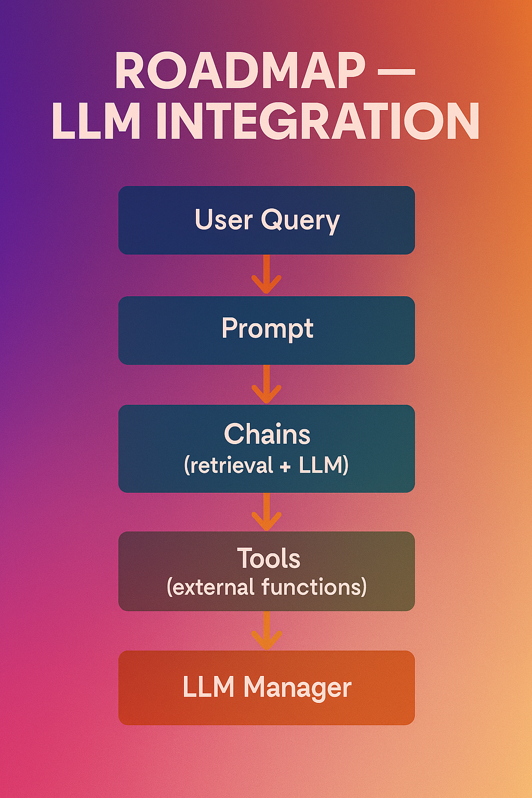

# **Finance RAG : 03 – LLM Integration**

"*This module represents the **third component** of the Finance-RAG architecture and is dedicated to **LLM integration**, delivering structured reasoning, modular orchestration, and auditable workflows. The **second stage is already complete**:
👉 [Finance-RAG-Retriever-Layer](https://github.com/Abdiasarsene/Finance-RAG-Retriever-Layer)
This layer established the retrieval and ranking foundation through a clean separation of sources, strategies, and documented artifacts. The LLM-Integration module sits on top of this foundation and implements a **reasoning-driven approach**, enabling LLMs to act as agents capable of interacting with tools, chains, prompts, and domain configurations.*"

---

---
## ⚙️ **Capabilities**

* Seamless integration with multiple LLM providers (OpenAI, local, HuggingFace, etc.)
* Modular orchestration of RAG pipelines (retrieval → reasoning → generation)
* Centralized management of prompts and conversational behavior
* Agent-driven tool execution via LangChain
* Explicit, documented configuration through Docker Compose
* Clear separation of responsibilities for transparency and extensibility

---

---

## 🔄 **Data Pipeline Overview**

The `prompts/` directory defines the system’s **conversational, cognitive, and business logic** — style, reasoning structure, tone, and domain intent. The `chains/` directory then orchestrates the full **retrieval → reasoning → generation** pipeline through modular, auditable, and testable components that ensure precision, transparency, and business alignment. The `tools/` folder exposes **external callable functions** — computations, validations, and system actions — giving the model capabilities that go far beyond text generation.

The `core/` module centralizes **configuration, coordination, and pipeline execution**, ensuring coherence across prompts, chains, tools, and LLM clients. The `llm_manager.py` file provides a unified abstraction over **OpenAI, Anthropic, and Mistral models**, allowing seamless provider switching without touching business logic or chain architecture.

---

---

## 🧱 **Architecture Snapshot**

---

---

## ✅ **Testing**

The testing pipeline ensures:

* Functional correctness of RAG chains
* Reliable integration with LLM clients
* Robustness of agent-triggered tools
* Code quality and standards via `pre-commit` and `mypy`

---

---

## 🔮 **Next Modules**

* **Finance-RAG-Agents** — role-specific financial agents
* **Finance-RAG-Serving-API** — FastAPI REST serving layer
* **Finance-RAG-LLMops** — monitoring, versioning, and artifact management
